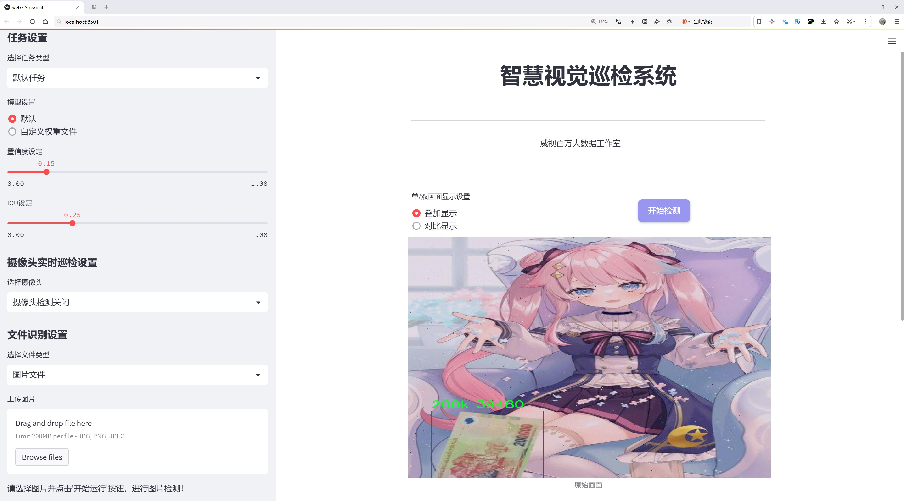
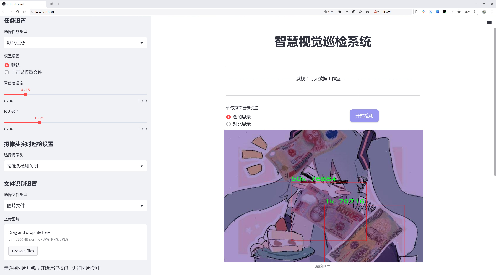
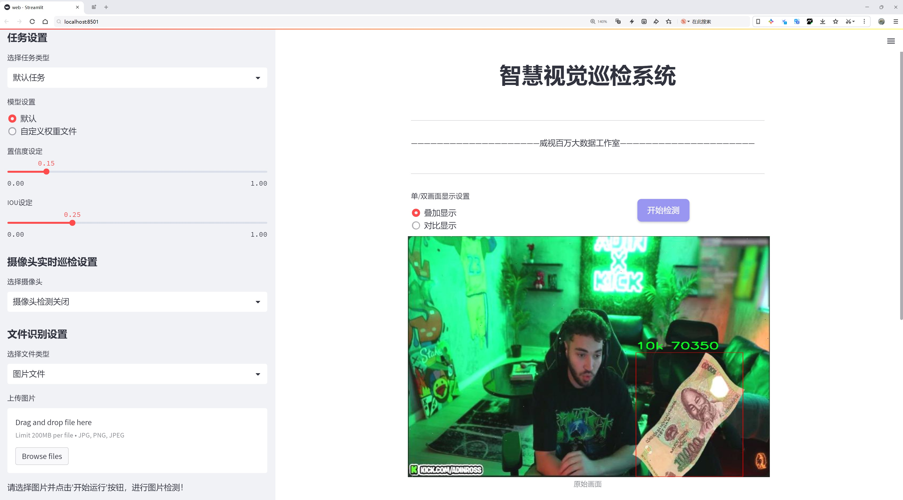
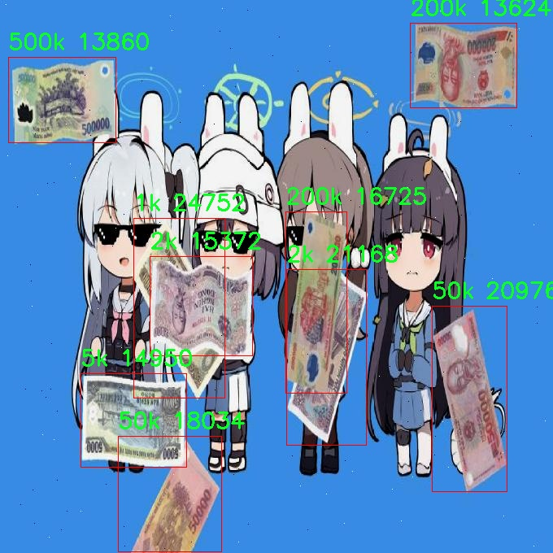
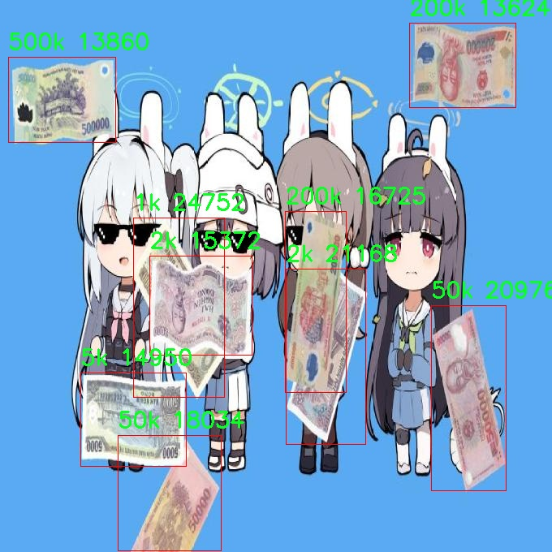

# 外国钞票面值检测系统源码分享
 # [一条龙教学YOLOV8标注好的数据集一键训练_70+全套改进创新点发刊_Web前端展示]

### 1.研究背景与意义

项目参考[AAAI Association for the Advancement of Artificial Intelligence](https://gitee.com/qunmasj/projects)

项目来源[AACV Association for the Advancement of Computer Vision](https://kdocs.cn/l/cszuIiCKVNis)

研究背景与意义

随着全球经济的不断发展，货币的流通和管理变得愈发重要。尤其是在国际贸易和金融交易中，准确识别和验证不同国家的钞票面值成为了保障经济安全和防范金融犯罪的关键环节。传统的钞票识别方法往往依赖人工识别和经验判断，效率低下且容易受到人为因素的影响，难以满足现代金融环境对高效性和准确性的要求。因此，基于计算机视觉和深度学习技术的自动化钞票面值检测系统应运而生，成为研究的热点。

在众多的深度学习模型中，YOLO（You Only Look Once）系列因其出色的实时检测能力和高精度而受到广泛关注。YOLOv8作为该系列的最新版本，进一步提升了目标检测的性能，尤其在处理复杂场景和多类别目标时展现出更强的适应性。针对外国钞票的面值检测，YOLOv8的优势在于其能够在较短的时间内处理大量图像数据，迅速识别出不同面值的钞票，从而为金融机构提供高效的解决方案。

本研究旨在基于改进的YOLOv8模型，构建一个高效的外国钞票面值检测系统。为此，我们使用了一个包含800张图像的数据集，涵盖了9个不同的钞票面值类别，具体包括100k、10k、1k、200k、20k、2k、500k、50k和5k。这些类别的多样性不仅能够反映出不同国家钞票的面值特征，还能帮助模型学习到更丰富的特征表示，从而提高其识别准确率。

在数据集的构建过程中，我们注重数据的多样性和代表性，确保所选图像能够涵盖不同的拍摄角度、光照条件和背景环境。这一策略将有助于提升模型的泛化能力，使其在实际应用中能够适应各种复杂的场景。此外，针对YOLOv8模型的改进，我们将探索不同的网络结构调整和超参数优化方法，以进一步提升模型的检测精度和速度。

本研究的意义不仅在于提升外国钞票面值检测的技术水平，更在于为金融机构提供一种可靠的工具，帮助其在日常运营中实现自动化和智能化管理。通过有效的钞票识别系统，金融机构能够降低人工成本，提高工作效率，同时减少因人为错误导致的经济损失。此外，该系统的成功应用还将为其他领域的目标检测提供借鉴，推动计算机视觉技术在金融、安防等行业的广泛应用。

综上所述，基于改进YOLOv8的外国钞票面值检测系统的研究，不仅具有重要的理论价值，还有着广泛的实际应用前景。通过深入探索这一领域，我们期望能够为金融安全提供新的技术保障，为国际经济的健康发展贡献力量。

### 2.图片演示







##### 注意：由于此博客编辑较早，上面“2.图片演示”和“3.视频演示”展示的系统图片或者视频可能为老版本，新版本在老版本的基础上升级如下：（实际效果以升级的新版本为准）

  （1）适配了YOLOV8的“目标检测”模型和“实例分割”模型，通过加载相应的权重（.pt）文件即可自适应加载模型。

  （2）支持“图片识别”、“视频识别”、“摄像头实时识别”三种识别模式。

  （3）支持“图片识别”、“视频识别”、“摄像头实时识别”三种识别结果保存导出，解决手动导出（容易卡顿出现爆内存）存在的问题，识别完自动保存结果并导出到tempDir中。

  （4）支持Web前端系统中的标题、背景图等自定义修改，后面提供修改教程。

  另外本项目提供训练的数据集和训练教程,暂不提供权重文件（best.pt）,需要您按照教程进行训练后实现图片演示和Web前端界面演示的效果。

### 3.视频演示

[3.1 视频演示](https://www.bilibili.com/video/BV1WC2EYJE8f/)

### 4.数据集信息展示

##### 4.1 本项目数据集详细数据（类别数＆类别名）

nc: 9
names: ['100k', '10k', '1k', '200k', '20k', '2k', '500k', '50k', '5k']


##### 4.2 本项目数据集信息介绍

数据集信息展示

在本研究中，我们使用了名为“budamonl”的数据集，旨在改进YOLOv8模型在外国钞票面值检测系统中的应用。该数据集的设计考虑到了多样性和复杂性，以确保模型能够在实际应用中表现出色。数据集包含9个类别，分别是：100k、10k、1k、200k、20k、2k、500k、50k和5k。这些类别涵盖了不同面值的钞票，能够为模型提供丰富的训练样本，从而提高其识别精度和鲁棒性。

“budamonl”数据集的构建过程非常严谨，首先收集了大量的外国钞票图像，这些图像来源于多个国家和地区，确保了数据集的多样性。每个类别的样本数量经过精心设计，以避免类别不平衡问题，确保每种面值的钞票都有足够的训练数据。这种平衡性对于模型的训练至关重要，因为它能够防止模型在某些类别上过拟合，而在其他类别上表现不佳。

在数据集的标注过程中，采用了先进的图像标注工具，确保每张钞票图像都被准确地标注为对应的面值。这些标注不仅包括了钞票的面值信息，还涵盖了钞票的各种特征，如颜色、图案和尺寸等。这些特征的标注为模型的学习提供了丰富的上下文信息，使其能够更好地理解和识别不同面值的钞票。

此外，为了增强数据集的多样性，我们还进行了数据增强处理，包括旋转、缩放、裁剪和颜色变换等。这些处理能够有效增加数据集的样本数量，并提高模型的泛化能力，使其在面对不同环境和条件下的钞票时，依然能够保持高效的识别性能。

在训练过程中，我们将“budamonl”数据集与YOLOv8模型相结合，利用其强大的特征提取能力和实时检测能力，旨在实现对外国钞票面值的快速、准确识别。YOLOv8的网络结构经过优化，能够处理复杂的图像特征，并在不同的尺度上进行检测，这使得它在钞票面值检测任务中表现出色。

通过对“budamonl”数据集的深入分析和研究，我们希望能够推动外国钞票面值检测技术的发展，尤其是在金融安全和反洗钱等领域的应用。随着技术的不断进步，基于深度学习的钞票识别系统将会越来越普及，成为现代金融交易中不可或缺的一部分。

总之，“budamonl”数据集为我们提供了一个强大的基础，使得YOLOv8模型能够在外国钞票面值检测任务中发挥出色的性能。通过精心设计的数据集和高效的模型训练，我们期待能够实现更高的识别精度和更快的处理速度，为金融行业的安全和效率做出贡献。







### 5.全套项目环境部署视频教程（零基础手把手教学）

[5.1 环境部署教程链接（零基础手把手教学）](https://www.ixigua.com/7404473917358506534?logTag=c807d0cbc21c0ef59de5)


[5.2 安装Python虚拟环境创建和依赖库安装视频教程链接（零基础手把手教学）](https://www.ixigua.com/7404474678003106304?logTag=1f1041108cd1f708b01a)

### 6.手把手YOLOV8训练视频教程（零基础小白有手就能学会）

[6.1 手把手YOLOV8训练视频教程（零基础小白有手就能学会）](https://www.ixigua.com/7404477157818401292?logTag=d31a2dfd1983c9668658)


按照上面的训练视频教程链接加载项目提供的数据集，运行train.py即可开始训练



     Epoch   gpu_mem       box       obj       cls    labels  img_size
     1/200     20.8G   0.01576   0.01955  0.007536        22      1280: 100%|██████████| 849/849 [14:42<00:00,  1.04s/it]
               Class     Images     Labels          P          R     mAP@.5 mAP@.5:.95: 100%|██████████| 213/213 [01:14<00:00,  2.87it/s]
                 all       3395      17314      0.994      0.957      0.0957      0.0843

     Epoch   gpu_mem       box       obj       cls    labels  img_size
     2/200     20.8G   0.01578   0.01923  0.007006        22      1280: 100%|██████████| 849/849 [14:44<00:00,  1.04s/it]
               Class     Images     Labels          P          R     mAP@.5 mAP@.5:.95: 100%|██████████| 213/213 [01:12<00:00,  2.95it/s]
                 all       3395      17314      0.996      0.956      0.0957      0.0845

     Epoch   gpu_mem       box       obj       cls    labels  img_size
     3/200     20.8G   0.01561    0.0191  0.006895        27      1280: 100%|██████████| 849/849 [10:56<00:00,  1.29it/s]
               Class     Images     Labels          P          R     mAP@.5 mAP@.5:.95: 100%|███████   | 187/213 [00:52<00:00,  4.04it/s]
                 all       3395      17314      0.996      0.957      0.0957      0.0845


### 7.70+种全套YOLOV8创新点代码加载调参视频教程（一键加载写好的改进模型的配置文件）

[7.1 70+种全套YOLOV8创新点代码加载调参视频教程（一键加载写好的改进模型的配置文件）](https://www.ixigua.com/7404478314661806627?logTag=29066f8288e3f4eea3a4)

### 8.70+种全套YOLOV8创新点原理讲解（非科班也可以轻松写刊发刊，V10版本正在科研待更新）

#### 由于篇幅限制，每个创新点的具体原理讲解就不一一展开，具体见下列网址中的创新点对应子项目的技术原理博客网址【Blog】：


[8.1 70+种全套YOLOV8创新点原理讲解链接](https://gitee.com/qunmasj/good)

#### 部分改进原理讲解(完整的改进原理见上图和技术博客链接)
### YOLOv8简介
YOLOv8目标检测算法继承了YOLOv1系列的思考,是一种新型端到端的目标检测算法,尽管现在原始检测算法已经开源,但是鲜有发表的相关论文.YOLOv8的网络结构如图所示,主要可分为Input输入端、Backbone骨干神经网络、Neck 混合特征网络层和Head预测层网络共4个部分.

YOLO目标检测算法是一种端到端的One-Slage 目标检测算法，其核心思想是将图像按区域分块进行预测。YOLO将输入图像按照32x32的大小划分成若干个网格，例如416x416的图像将被划分为13x13个网格。当目标物体的中心位于某个网格内时,该网格就会负责输出该物体的边界框和类别置信度。每个网格可以预测多个边界框和多个目标类别,这些边界框和类别的数量可以根据需要进行设置。YOLO算法的输出是一个特征图,包含了每个网格对应的边界框和类别置信度的信息呵。本文采用YOLO最新的YOLOv8模型，其是2022年底发布的最新YOLO系列模型，采用全新的SOTA模型，全新的网络主干结构,如图1所示。
整个网络分为Backbone 骨干网络部分和Head头部网络部分。YOLOv8汲取了前几代网络的优秀特性，骨干网络和 Neck部分遵循CSP的思想，将YOLOv5中的C3模块被替换成了梯度流更丰富C2模块,去掉YOLOv5中 PAN-FPN上采样阶段中的卷积结构,将Backbone不同阶段输出的特征直接送入了上采样操作,模型提供了N/S/M/L/X尺度的不同大小模型,能够满足不同领域业界的需求。本文基于YOLOv8模型设计番茄病虫害检测系统，通过配置模型参数训练番茄图像,得到能够用于部署应用的最优模型。


### 感受野注意力卷积（RFAConv)
#### 标准卷积操作回顾
标准的卷积操作是构造卷积神经网络的基本构件。它利用具有共享参数的滑动窗口提取特征信息，克服了全连通层构造神经网络固有的参数多、计算开销大的问题。设 X R∈C×H×W
表示输入特征图，其中C、H、W分别表示特征图的通道数、高度、宽度。为了清楚地演示卷积核的特征提取过程，我们使用 C = 1 的例子。从每个接受域滑块中提取特征信息的卷积运算可以表示为:


这里，Fi 表示计算后每个卷积滑块得到的值，Xi 表示每个滑块内对应位置的像素值，K表示卷积核，S表示卷积核中的参数个数，N表示接收域滑块的总数。可以看出，每个滑块内相同位置的 feature共享相同的参数Ki。因此，标准的卷积运算并不能捕捉到不同位置所带来的信息差异，这最终在一定程度上限制了卷积神经网络的性能。 

#### 空间注意力回顾
目前，空间注意机制是利用学习得到的注意图来突出每个特征的重要性。与前一节类似，这里以 C=1为例。突出关键特征的空间注意机制可以简单表述为:这里，Fi 表示加权运算后得到的值。xi 和Ai 表示输入特征图和学习到的注意图在不同位置的值，N为输入特征图的高和宽的乘积，表示像素值的总数。


#### 空间注意与标准卷积运算
将注意力机制整合到卷积神经网络中，可以提高卷积神经网络的性能。通过对标准卷积运算和现有空间注意机制的研究，我们认为空间注意机制有效地克服了卷积神经网络固有的参数共享的局限性。目前卷积神经网络中最常用的核大小是 1 × 1和3 × 3。在引入空间注意机制后，提取特征的卷积操作可以是 1 × 1或3 × 3卷积操作。为了直观地展示这个过程，在 1 × 1卷积运算的前面插入了空间注意机制。通过注意图对输入特征图(Re-weight“×”)进行加权运算，最后通过 1 × 1卷积运算提取接收域的滑块特征信息。整个过程可以简单地表示如下:


 这里卷积核K仅代表一个参数值。如果取A i× ki 的值作为一种新的卷积核参数，有趣的是它解决了 1×1卷积运算提取特征时的参数共享问题。然而，关于空间注意机制的传说到此结束。当空间注意机制被插入到3×3卷积运算前面时。具体情况如下:


如上所述，如果取A的值 i × ki (4)式作为一种新的卷积核参数，完全解决了大规模卷积核的参数共享问题。然而，最重要的一点是，卷积核在提取每个接受域滑块的特征时，会共享一些特征。换句话说，每个接收域滑块内都有一个重叠。仔细分析后会发现A12= a21， a13 = a22， a15 = a24……，在这种情况下，每个滑动窗口共享空间注意力地图的权重。因此，空间注意机制没有考虑整个接受域的空间特征，不能有效地解决大规模卷积核的参数共享问题。因此，空间注意机制的有效性受到限制。 

#### 创新空间注意力和标准卷积操作
该博客提出解决了现有空间注意机制的局限性，为空间处理提供了一种创新的解决方案。受RFA的启发，一系列空间注意机制被开发出来，可以进一步提高卷积神经网络的性能。RFA可以看作是一个轻量级即插即用模块，RFA设计的卷积运算(RFAConv)可以代替标准卷积来提高卷积神经网络的性能。因此，我们预测空间注意机制与标准卷积运算的结合将继续发展，并在未来带来新的突破。
接受域空间特征:为了更好地理解接受域空间特征的概念，我们将提供相关的定义。接收域空间特征是专门为卷积核设计的，并根据核大小动态生成。如图1所示，以3×3卷积核为例。在图1中，“Spatial Feature”指的是原始的Feature map。“接受域空间特征”是空间特征变换后的特征图。

 

由不重叠的滑动窗口组成。当使用 3×3卷积内核提取特征时，接收域空间特征中的每个 3×3大小窗口代表一个接收域滑块。接受域注意卷积(RFAConv):针对接受域的空间特征，我们提出了接受域注意卷积(RFA)。该方法不仅强调了接收域滑块内不同特征的重要性，而且对接收域空间特征进行了优先排序。通过该方法，完全解决了卷积核参数共享的问题。接受域空间特征是根据卷积核的大小动态生成的，因此，RFA是卷积的固定组合，不能与卷积操作的帮助分离，卷积操作同时依赖于RFA来提高性能，因此我们提出了接受场注意卷积(RFAConv)。具有3×3大小的卷积核的RFAConv整体结构如图所示。


目前，最广泛使用的接受域特征提取方法是缓慢的。经过大量的研究，我们开发了一种快速的方法，用分组卷积来代替原来的方法。具体来说，我们利用相应大小的分组卷积来动态生成基于接受域大小的展开特征。尽管与原始的无参数方法(如PyTorch提供的nn.())相比，该方法增加了一些参数，但它的速度要快得多。注意:如前一节所述，当使用 3×3卷积内核提取特征时，接收域空间特征中的每个 3×3大小窗口表示一个接收域滑块。而利用快速分组卷积提取感受野特征后，将原始特征映射为新的特征。最近的研究表明。交互信息可以提高网络性能，如[40,41,42]所示。同样，对于RFAConv来说，通过交互接受域特征信息来学习注意图可以提高网络性能。然而，与每个接收域特征交互会导致额外的计算开销，因此为了最小化计算开销和参数的数量，我们使用AvgPool来聚合每个接收域特征的全局信息。然后，使用 1×1 组卷积操作进行信息交互。最后，我们使用softmax来强调每个特征在接受域特征中的重要性。一般情况下，RFA的计算可以表示为:


这里gi×i 表示一个大小为 i×i的分组卷积，k表示卷积核的大小，Norm表示归一化，X表示输入的特征图，F由注意图 a相乘得到 rf 与转换后的接受域空间特征 Frf。与CBAM和CA不同，RFA能够为每个接受域特征生成注意图。卷积神经网络的性能受到标准卷积操作的限制，因为卷积操作依赖于共享参数，对位置变化带来的信息差异不敏感。然而，RFAConv通过强调接收域滑块中不同特征的重要性，并对接收域空间特征进行优先级排序，可以完全解决这个问题。通过RFA得到的feature map是接受域空间特征，在“Adjust Shape”后没有重叠。因此，学习到的注意图将每个接受域滑块的特征信息聚合起来。换句话说，注意力地图不再共享在每个接受域滑块。这完全弥补了现有 CA和CBAM注意机制的不足。RFA为标准卷积内核提供了显著的好处。而在调整形状后，特征的高度和宽度是 k倍，需要进行 stride = k的k × k卷积运算来提取特征信息。RFA设计的卷积运算RFAConv为卷积带来了良好的增益，对标准卷积进行了创新。
此外，我们认为现有的空间注意机制应该优先考虑接受域空间特征，以提高网络性能。众所周知，基于自注意机制的网络模型[43,44,45]取得了很大的成功，因为它解决了卷积参数共享的问题，并对远程信息进行建模。然而，自注意机制也为模型引入了显著的计算开销和复杂性。我们认为，将现有的空间注意机制的注意力引导到接受场空间特征上，可以以类似于自我注意的方式解决长期信息的参数共享和建模问题。与自我关注相比，这种方法需要的参数和计算资源少得多。答案如下:(1)将以接收场空间特征为中心的空间注意机制与卷积相结合，消除了卷积参数共享的问题。(2)现有的空间注意机制已经考虑了远程信息，可以通过全局平均池或全局最大池的方式获取全局信息，其中明确考虑了远程信息。因此，我们设计了新的 CBAM和CA模型，称为RFCBAM和RFCA，它们专注于接受域空间特征。与RFA类似，使用最终的k × k stride = k 的卷积运算来提取特征信息。这两种新的卷积方法的具体结构如图 3所示，我们称这两种新的卷积操作为 RFCBAMConv和RFCAConv。与原来的CBAM相比，我们在RFCBAM中使用SE attention来代替CAM。因为这样可以减少计算开销。此外，在RFCBAM中，通道注意和空间注意不是分开执行的。相反，它们是同时加权的，使得每个通道获得的注意力地图是不同的。


### 9.系统功能展示（检测对象为举例，实际内容以本项目数据集为准）

图9.1.系统支持检测结果表格显示

  图9.2.系统支持置信度和IOU阈值手动调节

  图9.3.系统支持自定义加载权重文件best.pt(需要你通过步骤5中训练获得)

  图9.4.系统支持摄像头实时识别

  图9.5.系统支持图片识别

  图9.6.系统支持视频识别

  图9.7.系统支持识别结果文件自动保存

  图9.8.系统支持Excel导出检测结果数据


### 10.原始YOLOV8算法原理

原始YOLOv8算法原理

YOLOv8算法是由Ultralytics公司于2023年推出的目标检测领域的最新进展，标志着YOLO系列算法的又一次重大飞跃。作为YOLO系列中的一员，YOLOv8继承了其前辈的设计理念，同时在多个方面进行了创新和优化，尤其是在模型结构、特征提取、损失函数以及检测策略等方面的改进，使其在精度和速度上都达到了新的高度。

YOLOv8n作为该系列的一个重要版本，采用了C2f模块替代了YOLOv5中的C3模块。这一改进使得特征提取过程更加高效。C2f模块通过将特征提取分为两部分，分别进行卷积和连接，能够更好地捕捉图像中的重要信息。主干网络依然采用了跨级结构（CSP），这一设计理念使得网络在保持较高的计算效率的同时，能够有效地提取图像特征。末尾的SPPF模块则进一步提高了模型的计算速度，确保了在处理复杂场景时的实时性。

在特征融合方面，YOLOv8采用了PAN-FPN（Path Aggregation Network - Feature Pyramid Network）结构，这一结构通过多尺度特征的融合，增强了模型对不同尺寸目标的检测能力。PAN-FPN通过上采样和下采样的方式，将不同层次的特征进行有效结合，使得网络能够在不同的空间尺度上进行信息的整合，进而提升了目标检测的精度。

YOLOv8在检测策略上采用了Anchor-Free的方式，这一方法相较于传统的Anchor-Based检测方式，能够显著提高检测精度和速度。传统的Anchor-Based方法往往需要预定义多个锚框，而YOLOv8通过解耦头结构（Decoupled Head）来实现分类和回归过程的分离，使得模型在进行目标检测时能够更加灵活和高效。具体而言，Detect模块的设计允许模型在进行目标分类时，不再依赖于固定的锚框，而是通过学习特征来直接预测目标的位置和类别，这一策略有效减少了模型的复杂性，并提升了检测的准确性。

在损失函数的设计上，YOLOv8引入了新的损失策略。通过变焦损失（Focal Loss）来计算分类损失，结合数据平均保真度损失和完美交并比损失（CloU）来计算边界框损失。这种新的损失计算方式使得模型在面对复杂背景和小目标时，能够更好地进行目标检测，尤其是在高难度场景下，模型的表现更加出色。

YOLOv8的整体架构设计充分考虑了实时性与准确性的平衡，尤其是在处理复杂环境时，能够有效应对小目标的检测问题。尽管YOLOv8在多方面进行了优化，但在某些特定场景下，如复杂水面环境中的小目标漂浮物检测，仍然存在一定的挑战。为了解决这些问题，后续的研究提出了YOLOv8-WSSOD算法，通过引入双层路由注意力机制（BiFormer）来增强特征提取过程中的上下文信息，同时在Neck端引入GSConv和Slim-neck技术，以保持精度并降低计算量。这些改进措施使得YOLOv8在特定应用场景下的表现得到了进一步提升。

综上所述，YOLOv8算法在目标检测领域的创新和优化，使其成为当前最先进的目标检测算法之一。通过引入轻量化的特征提取网络、优化的损失函数和灵活的检测策略，YOLOv8不仅在精度和速度上达到了新的高度，同时也为后续的研究和应用提供了更为广阔的空间。随着YOLOv8的不断发展和改进，其在实际应用中的潜力将会更加显著，推动目标检测技术向更高的水平迈进。


### 11.项目核心源码讲解（再也不用担心看不懂代码逻辑）

#### 11.1 70+种YOLOv8算法改进源码大全和调试加载训练教程（非必要）\ultralytics\hub\session.py

以下是对代码的核心部分进行提炼和详细注释的结果：

```python
# Ultralytics YOLO 🚀, AGPL-3.0 license

import signal
import sys
from pathlib import Path
from time import sleep
import requests
from ultralytics.hub.utils import HUB_API_ROOT, HUB_WEB_ROOT, smart_request
from ultralytics.utils import LOGGER, __version__, checks, is_colab
from ultralytics.utils.errors import HUBModelError

# 根据运行环境设置代理名称
AGENT_NAME = f'python-{__version__}-colab' if is_colab() else f'python-{__version__}-local'

class HUBTrainingSession:
    """
    HUB训练会话类，用于管理Ultralytics HUB YOLO模型的初始化、心跳和检查点上传。
    """

    def __init__(self, url):
        """
        初始化HUBTrainingSession，设置模型标识符和相关参数。

        Args:
            url (str): 模型标识符，可以是URL字符串或特定格式的模型键。

        Raises:
            ValueError: 如果提供的模型标识符无效。
            ConnectionError: 如果连接全局API密钥不被支持。
        """
        from ultralytics.hub.auth import Auth

        # 解析输入的URL
        if url.startswith(f'{HUB_WEB_ROOT}/models/'):
            url = url.split(f'{HUB_WEB_ROOT}/models/')[-1]
        if [len(x) for x in url.split('_')] == [42, 20]:
            key, model_id = url.split('_')
        elif len(url) == 20:
            key, model_id = '', url
        else:
            raise HUBModelError(f"model='{url}' not found. Check format is correct.")

        # 授权
        auth = Auth(key)
        self.agent_id = None  # 识别与服务器通信的实例
        self.model_id = model_id
        self.model_url = f'{HUB_WEB_ROOT}/models/{model_id}'
        self.api_url = f'{HUB_API_ROOT}/v1/models/{model_id}'
        self.auth_header = auth.get_auth_header()
        self.rate_limits = {'metrics': 3.0, 'ckpt': 900.0, 'heartbeat': 300.0}  # API调用的速率限制
        self.metrics_queue = {}  # 模型指标队列
        self.model = self._get_model()  # 获取模型数据
        self.alive = True  # 心跳循环状态
        self._start_heartbeat()  # 启动心跳
        self._register_signal_handlers()  # 注册信号处理器
        LOGGER.info(f'View model at {self.model_url} 🚀')

    def _register_signal_handlers(self):
        """注册信号处理器以优雅地处理终止信号。"""
        signal.signal(signal.SIGTERM, self._handle_signal)
        signal.signal(signal.SIGINT, self._handle_signal)

    def _handle_signal(self, signum, frame):
        """
        处理终止信号，防止在Colab中终止后发送心跳。

        Args:
            signum: 信号编号
            frame: 当前栈帧（未使用）
        """
        if self.alive:
            LOGGER.info('Kill signal received! ❌')
            self._stop_heartbeat()  # 停止心跳
            sys.exit(signum)  # 退出程序

    def _stop_heartbeat(self):
        """终止心跳循环。"""
        self.alive = False

    def upload_metrics(self):
        """上传模型指标到Ultralytics HUB。"""
        payload = {'metrics': self.metrics_queue.copy(), 'type': 'metrics'}
        smart_request('post', self.api_url, json=payload, headers=self.auth_header)

    def _get_model(self):
        """从Ultralytics HUB获取并返回模型数据。"""
        api_url = f'{HUB_API_ROOT}/v1/models/{self.model_id}'
        try:
            response = smart_request('get', api_url, headers=self.auth_header)
            data = response.json().get('data', None)

            if data.get('status') == 'trained':
                raise ValueError('Model is already trained and uploaded.')

            if not data.get('data'):
                raise ValueError('Dataset may still be processing. Please wait and try again.')

            self.model_id = data['id']  # 更新模型ID

            # 根据模型状态设置训练参数
            if data['status'] == 'new':
                self.train_args = {
                    'batch': data['batch_size'],
                    'epochs': data['epochs'],
                    'imgsz': data['imgsz'],
                    'patience': data['patience'],
                    'device': data['device'],
                    'cache': data['cache'],
                    'data': data['data']
                }
                self.model_file = data.get('cfg') or data.get('weights')
                self.model_file = checks.check_yolov5u_filename(self.model_file, verbose=False)
            elif data['status'] == 'training':
                self.train_args = {'data': data['data'], 'resume': True}
                self.model_file = data['resume']

            return data
        except requests.exceptions.ConnectionError as e:
            raise ConnectionRefusedError('ERROR: The HUB server is not online.') from e

    def upload_model(self, epoch, weights, is_best=False, map=0.0, final=False):
        """
        上传模型检查点到Ultralytics HUB。

        Args:
            epoch (int): 当前训练的轮次。
            weights (str): 模型权重文件的路径。
            is_best (bool): 当前模型是否是最好的模型。
            map (float): 模型的平均精度。
            final (bool): 当前模型是否是训练后的最终模型。
        """
        if Path(weights).is_file():
            with open(weights, 'rb') as f:
                file = f.read()
        else:
            LOGGER.warning(f'Model upload issue. Missing model {weights}.')
            file = None

        url = f'{self.api_url}/upload'
        data = {'epoch': epoch}
        if final:
            data.update({'type': 'final', 'map': map})
            filesize = Path(weights).stat().st_size
            smart_request('post', url, data=data, files={'best.pt': file}, headers=self.auth_header)
        else:
            data.update({'type': 'epoch', 'isBest': bool(is_best)})
            smart_request('post', url, data=data, files={'last.pt': file}, headers=self.auth_header)

    def _start_heartbeat(self):
        """开始一个线程心跳循环，向Ultralytics HUB报告代理状态。"""
        while self.alive:
            r = smart_request('post', f'{HUB_API_ROOT}/v1/agent/heartbeat/models/{self.model_id}',
                              json={'agent': AGENT_NAME, 'agentId': self.agent_id},
                              headers=self.auth_header)
            self.agent_id = r.json().get('data', {}).get('agentId', None)
            sleep(self.rate_limits['heartbeat'])  # 根据速率限制进行休眠
```

### 代码核心部分说明：
1. **HUBTrainingSession类**：用于管理与Ultralytics HUB的训练会话，包括模型的初始化、心跳机制和指标上传。
2. **初始化方法**：解析模型标识符，进行授权，设置API相关参数，并启动心跳机制。
3. **信号处理**：注册终止信号的处理，确保在接收到终止信号时能够优雅地停止心跳并退出程序。
4. **上传指标和模型**：提供上传模型训练指标和模型检查点的方法，确保训练过程中的数据能够及时上传到服务器。
5. **心跳机制**：通过一个线程定期向服务器发送心跳，报告代理的状态，确保与服务器的连接保持活跃。

这个文件是Ultralytics YOLO（You Only Look Once）模型的一个训练会话管理类，主要用于处理与Ultralytics HUB的交互，包括模型的初始化、心跳信号的发送和检查点的上传等功能。

在文件的开头，首先导入了一些必要的库和模块，包括信号处理、系统操作、路径处理、时间控制以及HTTP请求等。接着定义了一个常量`AGENT_NAME`，用于标识当前的Python环境是Colab还是本地。

接下来，定义了`HUBTrainingSession`类，这个类负责管理与Ultralytics HUB的训练会话。构造函数`__init__`接受一个模型标识符`url`，并根据这个标识符初始化会话。它会解析输入的URL，提取出模型的关键字和ID，并进行身份验证。如果输入的格式不正确，则会抛出一个自定义的异常`HUBModelError`。

在初始化过程中，类还会设置一些属性，例如代理ID、模型ID、模型的URL、API的URL、身份验证头、速率限制、定时器、模型的度量队列以及模型数据等。它会调用`_get_model`方法从Ultralytics HUB获取模型数据，并启动心跳信号的发送。

`_register_signal_handlers`方法用于注册信号处理器，以便在接收到终止信号时能够优雅地处理会话的结束。`_handle_signal`方法则处理实际的信号，确保在Colab环境中终止后不会继续发送心跳信号。

`upload_metrics`方法用于将模型的度量数据上传到Ultralytics HUB。`_get_model`方法则负责从HUB获取模型数据，并根据模型的状态（如新模型、正在训练的模型等）设置训练参数。

`upload_model`方法用于将模型的检查点上传到Ultralytics HUB。它接受当前的训练轮次、权重文件路径、是否是最佳模型、模型的平均精度等参数，并根据这些参数将模型的权重文件上传。

最后，`_start_heartbeat`方法是一个线程函数，用于定期向Ultralytics HUB发送心跳信号，报告代理的状态。这是一个循环操作，直到会话被终止。

总的来说，这个文件实现了YOLO模型与Ultralytics HUB之间的交互，确保模型训练过程中的数据能够被有效地上传和管理。

#### 11.2 code\ultralytics\utils\plotting.py

以下是代码中最核心的部分，并附上详细的中文注释：

```python
class Colors:
    """
    Ultralytics 默认颜色调色板类。

    该类提供了与 Ultralytics 颜色调色板相关的方法，包括将十六进制颜色代码转换为 RGB 值。

    属性:
        palette (list of tuple): RGB 颜色值列表。
        n (int): 调色板中的颜色数量。
        pose_palette (np.array): 特定的颜色调色板数组，数据类型为 np.uint8。
    """

    def __init__(self):
        """初始化颜色为十六进制格式的 matplotlib.colors.TABLEAU_COLORS.values()。"""
        hexs = (
            "FF3838", "FF9D97", "FF701F", "FFB21D", "CFD231",
            "48F90A", "92CC17", "3DDB86", "1A9334", "00D4BB",
            "2C99A8", "00C2FF", "344593", "6473FF", "0018EC",
            "8438FF", "520085", "CB38FF", "FF95C8", "FF37C7",
        )
        # 将十六进制颜色转换为 RGB 并存储在 palette 中
        self.palette = [self.hex2rgb(f"#{c}") for c in hexs]
        self.n = len(self.palette)  # 颜色数量
        # 定义特定的颜色调色板
        self.pose_palette = np.array(
            [
                [255, 128, 0], [255, 153, 51], [255, 178, 102],
                [230, 230, 0], [255, 153, 255], [153, 204, 255],
                [255, 102, 255], [255, 51, 255], [102, 178, 255],
                [51, 153, 255], [255, 153, 153], [255, 102, 102],
                [255, 51, 51], [153, 255, 153], [102, 255, 102],
                [51, 255, 51], [0, 255, 0], [0, 0, 255],
                [255, 0, 0], [255, 255, 255],
            ],
            dtype=np.uint8,
        )

    def __call__(self, i, bgr=False):
        """将十六进制颜色代码转换为 RGB 值。"""
        c = self.palette[int(i) % self.n]  # 获取颜色
        return (c[2], c[1], c[0]) if bgr else c  # 如果需要 BGR 格式则返回 BGR，否则返回 RGB

    @staticmethod
    def hex2rgb(h):
        """将十六进制颜色代码转换为 RGB 值（即默认的 PIL 顺序）。"""
        return tuple(int(h[1 + i : 1 + i + 2], 16) for i in (0, 2, 4))


class Annotator:
    """
    Ultralytics 注释器，用于训练/验证马赛克和 JPG 及预测注释。

    属性:
        im (Image.Image 或 numpy array): 要注释的图像。
        pil (bool): 是否使用 PIL 或 cv2 绘制注释。
        font (ImageFont.truetype 或 ImageFont.load_default): 用于文本注释的字体。
        lw (float): 绘制的线宽。
        skeleton (List[List[int]]): 关键点的骨架结构。
        limb_color (List[int]): 四肢的颜色调色板。
        kpt_color (List[int]): 关键点的颜色调色板。
    """

    def __init__(self, im, line_width=None, font_size=None, font="Arial.ttf", pil=False, example="abc"):
        """初始化 Annotator 类，设置图像和线宽以及关键点和四肢的颜色调色板。"""
        assert im.data.contiguous, "图像不连续。请对 Annotator() 输入图像应用 np.ascontiguousarray(im)。"
        non_ascii = not is_ascii(example)  # 检查是否为非 ASCII 字符
        self.pil = pil or non_ascii  # 根据输入决定使用 PIL 还是 cv2
        self.lw = line_width or max(round(sum(im.shape) / 2 * 0.003), 2)  # 设置线宽
        if self.pil:  # 使用 PIL
            self.im = im if isinstance(im, Image.Image) else Image.fromarray(im)
            self.draw = ImageDraw.Draw(self.im)  # 创建绘图对象
            try:
                font = check_font("Arial.Unicode.ttf" if non_ascii else font)  # 检查字体
                size = font_size or max(round(sum(self.im.size) / 2 * 0.035), 12)  # 设置字体大小
                self.font = ImageFont.truetype(str(font), size)  # 加载字体
            except Exception:
                self.font = ImageFont.load_default()  # 加载默认字体
        else:  # 使用 cv2
            self.im = im if im.flags.writeable else im.copy()  # 确保图像可写
            self.tf = max(self.lw - 1, 1)  # 字体厚度
            self.sf = self.lw / 3  # 字体缩放

        # 关键点骨架结构
        self.skeleton = [
            [16, 14], [14, 12], [17, 15], [15, 13], [12, 13],
            [6, 12], [7, 13], [6, 7], [6, 8], [7, 9],
            [8, 10], [9, 11], [2, 3], [1, 2], [1, 3],
            [2, 4], [3, 5], [4, 6], [5, 7],
        ]

        # 设置四肢和关键点的颜色
        self.limb_color = colors.pose_palette[[9, 9, 9, 9, 7, 7, 7, 0, 0, 0, 0, 0, 16, 16, 16, 16, 16, 16, 16]]
        self.kpt_color = colors.pose_palette[[16, 16, 16, 16, 16, 0, 0, 0, 0, 0, 0, 9, 9, 9, 9, 9, 9]]

    def box_label(self, box, label="", color=(128, 128, 128), txt_color=(255, 255, 255), rotated=False):
        """在图像上添加一个 xyxy 矩形框及其标签。"""
        if isinstance(box, torch.Tensor):
            box = box.tolist()  # 将张量转换为列表
        if self.pil or not is_ascii(label):
            if rotated:
                p1 = box[0]
                self.draw.polygon([tuple(b) for b in box], width=self.lw, outline=color)  # 绘制多边形
            else:
                p1 = (box[0], box[1])
                self.draw.rectangle(box, width=self.lw, outline=color)  # 绘制矩形框
            if label:
                w, h = self.font.getsize(label)  # 获取文本宽度和高度
                outside = p1[1] - h >= 0  # 检查标签是否适合框外
                self.draw.rectangle(
                    (p1[0], p1[1] - h if outside else p1[1], p1[0] + w + 1, p1[1] + 1 if outside else p1[1] + h + 1),
                    fill=color,
                )
                self.draw.text((p1[0], p1[1] - h if outside else p1[1]), label, fill=txt_color, font=self.font)  # 绘制文本
        else:  # 使用 cv2
            if rotated:
                p1 = [int(b) for b in box[0]]
                cv2.polylines(self.im, [np.asarray(box, dtype=int)], True, color, self.lw)  # 绘制多边形
            else:
                p1, p2 = (int(box[0]), int(box[1])), (int(box[2]), int(box[3]))
                cv2.rectangle(self.im, p1, p2, color, thickness=self.lw, lineType=cv2.LINE_AA)  # 绘制矩形框
            if label:
                w, h = cv2.getTextSize(label, 0, fontScale=self.sf, thickness=self.tf)[0]  # 获取文本宽度和高度
                outside = p1[1] - h >= 3
                p2 = p1[0] + w, p1[1] - h - 3 if outside else p1[1] + h + 3
                cv2.rectangle(self.im, p1, p2, color, -1, cv2.LINE_AA)  # 填充矩形
                cv2.putText(
                    self.im,
                    label,
                    (p1[0], p1[1] - 2 if outside else p1[1] + h + 2),
                    0,
                    self.sf,
                    txt_color,
                    thickness=self.tf,
                    lineType=cv2.LINE_AA,
                )

    def result(self):
        """返回带注释的图像作为数组。"""
        return np.asarray(self.im)
```

以上代码片段主要包含了颜色处理和图像注释的核心功能。`Colors` 类用于处理颜色的转换，而 `Annotator` 类则用于在图像上绘制框、标签和关键点等注释。

这个程序文件是Ultralytics YOLO项目中的一个绘图工具模块，主要用于处理图像的可视化和标注。文件中包含多个类和函数，主要功能包括颜色管理、图像注释、绘制边界框、绘制关键点、绘制掩码、保存图像等。

首先，`Colors`类定义了一组颜色调色板，支持将十六进制颜色代码转换为RGB值。这个类在初始化时会生成一系列的颜色，并提供一个调用方法，可以根据索引返回相应的颜色。

接下来是`Annotator`类，它是用于在图像上进行标注的核心类。该类支持使用PIL或OpenCV库来绘制注释。初始化时需要传入图像、线宽、字体等参数。`Annotator`类提供了多种方法，例如`box_label`用于在图像上绘制边界框和标签，`masks`用于绘制掩码，`kpts`用于绘制关键点，`rectangle`和`text`用于绘制矩形和文本。

在`Annotator`类中，`box_label`方法可以在图像上添加一个边界框，并可选地添加标签。`masks`方法则可以将预测的掩码绘制到图像上，支持透明度设置。`kpts`方法用于绘制关键点，并可选择连接关键点的线条。

此外，`plot_labels`函数用于绘制训练标签，包括类直方图和边界框统计信息。`save_one_box`函数用于根据给定的边界框从图像中裁剪出一部分并保存。`plot_images`函数则用于绘制带有标签的图像网格。

文件还包含一些用于绘制训练结果的函数，如`plot_results`和`plot_tune_results`，它们从CSV文件中读取数据并生成相应的图表。`output_to_target`和`output_to_rotated_target`函数用于将模型输出转换为可用于绘图的目标格式。

最后，`feature_visualization`函数用于可视化模型推理过程中某个模块的特征图，帮助用户理解模型的内部工作。

整体来看，这个模块提供了丰富的图像处理和可视化功能，方便用户在使用YOLO模型进行目标检测和其他计算机视觉任务时进行结果分析和展示。

#### 11.3 70+种YOLOv8算法改进源码大全和调试加载训练教程（非必要）\ultralytics\utils\plotting.py

以下是经过简化并添加详细中文注释的核心代码部分：

```python
import numpy as np
import cv2
from PIL import Image, ImageDraw, ImageFont

class Colors:
    """
    颜色类，用于管理和转换颜色。
    """

    def __init__(self):
        """初始化颜色调色板。"""
        # 定义十六进制颜色值
        hexs = ('FF3838', 'FF9D97', 'FF701F', 'FFB21D', 'CFD231', 
                '48F90A', '92CC17', '3DDB86', '1A9334', '00D4BB',
                '2C99A8', '00C2FF', '344593', '6473FF', '0018EC', 
                '8438FF', '520085', 'CB38FF', 'FF95C8', 'FF37C7')
        # 将十六进制颜色转换为RGB格式
        self.palette = [self.hex2rgb(f'#{c}') for c in hexs]
        self.n = len(self.palette)  # 颜色数量

    @staticmethod
    def hex2rgb(h):
        """将十六进制颜色转换为RGB格式。"""
        return tuple(int(h[1 + i:1 + i + 2], 16) for i in (0, 2, 4))

colors = Colors()  # 创建颜色实例

class Annotator:
    """
    注释类，用于在图像上绘制框、文本和关键点。
    """

    def __init__(self, im, line_width=None, font_size=None, font='Arial.ttf', pil=False):
        """初始化Annotator类，设置图像和绘制参数。"""
        self.im = im if isinstance(im, Image.Image) else Image.fromarray(im)  # 将输入图像转换为PIL格式
        self.draw = ImageDraw.Draw(self.im)  # 创建绘图对象
        self.lw = line_width or 2  # 设置线宽
        # 尝试加载字体
        try:
            self.font = ImageFont.truetype(font, font_size or 12)
        except Exception:
            self.font = ImageFont.load_default()  # 加载默认字体

    def box_label(self, box, label='', color=(128, 128, 128), txt_color=(255, 255, 255)):
        """在图像上绘制一个带标签的矩形框。"""
        self.draw.rectangle(box, outline=color, width=self.lw)  # 绘制矩形框
        if label:
            # 获取文本的宽度和高度
            w, h = self.font.getsize(label)
            # 在框的上方绘制标签
            self.draw.text((box[0], box[1] - h), label, fill=txt_color, font=self.font)

    def result(self):
        """返回注释后的图像。"""
        return np.asarray(self.im)  # 将PIL图像转换为numpy数组

def save_one_box(xyxy, im, file='im.jpg', gain=1.02, pad=10, square=False):
    """
    根据给定的边界框保存图像的裁剪部分。
    
    Args:
        xyxy (list): 边界框坐标 [x1, y1, x2, y2]。
        im (numpy.ndarray): 输入图像。
        file (str): 保存路径。
        gain (float): 边界框大小的增益因子。
        pad (int): 边界框的填充像素。
        square (bool): 是否将裁剪区域变为正方形。
    """
    # 计算裁剪区域
    b = np.array(xyxy)
    if square:
        b[2:] = b[2:].max()  # 尝试将矩形变为正方形
    b[2:] = b[2:] * gain + pad  # 应用增益和填充
    crop = im[int(b[1]):int(b[3]), int(b[0]):int(b[2])]  # 裁剪图像
    Image.fromarray(crop).save(file)  # 保存裁剪后的图像

# 示例用法
# im = cv2.imread('image.jpg')  # 读取图像
# save_one_box([50, 50, 150, 150], im, file='cropped.jpg', square=True)  # 保存裁剪后的图像
```

### 代码说明：
1. **Colors类**：用于管理颜色，提供从十六进制到RGB的转换。
2. **Annotator类**：用于在图像上绘制矩形框和文本，支持PIL图像的操作。
3. **save_one_box函数**：根据给定的边界框裁剪图像并保存。支持增益和填充参数。

以上代码是对原始代码的简化和注释，保留了核心功能。

这个程序文件是一个用于YOLOv8算法的可视化和绘图工具，主要用于处理图像标注、绘制结果和生成统计图表。文件中包含多个类和函数，以下是对其主要部分的讲解。

首先，文件导入了一些必要的库，包括`cv2`（OpenCV）、`matplotlib`、`numpy`、`torch`和`PIL`等，这些库提供了图像处理、绘图和深度学习所需的功能。

`Colors`类定义了一组颜色，用于在图像中绘制不同的标注。它包含一个初始化方法，设置了一些预定义的颜色值，并提供了将十六进制颜色代码转换为RGB值的方法。该类的实例在后续的绘图过程中被频繁使用。

`Annotator`类是一个核心类，负责在图像上绘制各种标注，包括边框、文本、关键点和掩码。它的构造函数接受图像、线宽、字体等参数，并根据选择使用PIL或OpenCV进行绘制。该类中定义了多个方法，例如`box_label`用于绘制边框和标签，`masks`用于绘制掩码，`kpts`用于绘制关键点及其连接线等。

接下来的函数如`plot_labels`、`save_one_box`、`plot_images`等，分别用于绘制标签、保存图像裁剪、绘制图像网格等。这些函数通过接收不同的参数来实现灵活的绘图功能。例如，`plot_labels`函数绘制训练标签的直方图和箱线图，并保存为图像文件；`save_one_box`函数根据给定的边界框裁剪图像并保存。

`plot_results`函数用于从CSV文件中读取训练结果并绘制相应的图表，支持分割、姿态估计和分类等不同类型的数据。它使用`pandas`读取数据，并通过`matplotlib`绘制各种统计图表。

此外，文件中还定义了一些用于可视化超参数调优结果的函数，如`plot_tune_results`，以及用于输出模型预测结果的`output_to_target`函数。

最后，`feature_visualization`函数用于可视化模型在推理过程中某个模块的特征图。它将特征图分块并绘制，帮助开发者理解模型的内部工作。

总体而言，这个文件提供了一整套工具，用于YOLOv8模型的结果可视化和分析，便于开发者在训练和推理过程中对模型性能进行评估和调试。

#### 11.4 ui.py

以下是代码中最核心的部分，并附上详细的中文注释：

```python
import sys
import subprocess

def run_script(script_path):
    """
    使用当前 Python 环境运行指定的脚本。

    Args:
        script_path (str): 要运行的脚本路径

    Returns:
        None
    """
    # 获取当前 Python 解释器的路径
    python_path = sys.executable

    # 构建运行命令，使用 streamlit 运行指定的脚本
    command = f'"{python_path}" -m streamlit run "{script_path}"'

    # 执行命令
    result = subprocess.run(command, shell=True)
    # 检查命令执行的返回码，如果不为0则表示出错
    if result.returncode != 0:
        print("脚本运行出错。")

# 实例化并运行应用
if __name__ == "__main__":
    # 指定要运行的脚本路径
    script_path = "web.py"  # 这里可以直接指定脚本名

    # 调用函数运行脚本
    run_script(script_path)
```

### 代码说明：
1. **导入模块**：
   - `sys`：用于访问与 Python 解释器相关的变量和函数。
   - `subprocess`：用于执行外部命令和程序。

2. **定义 `run_script` 函数**：
   - 该函数接受一个参数 `script_path`，表示要运行的 Python 脚本的路径。
   - 使用 `sys.executable` 获取当前 Python 解释器的路径，以确保使用相同的环境运行脚本。
   - 构建一个命令字符串，使用 `streamlit` 模块运行指定的脚本。
   - 使用 `subprocess.run` 执行命令，并检查返回码以判断脚本是否成功运行。

3. **主程序入口**：
   - 在 `if __name__ == "__main__":` 块中，指定要运行的脚本路径（此处为 `web.py`）。
   - 调用 `run_script` 函数，传入脚本路径以执行该脚本。

这个程序文件名为 `ui.py`，其主要功能是使用当前的 Python 环境来运行一个指定的脚本，具体是一个名为 `web.py` 的文件。程序首先导入了必要的模块，包括 `sys`、`os` 和 `subprocess`，这些模块提供了与系统交互的功能。

在 `run_script` 函数中，程序接受一个参数 `script_path`，这是要运行的脚本的路径。函数首先获取当前 Python 解释器的路径，这通过 `sys.executable` 实现。接着，程序构建一个命令字符串，该命令使用 `streamlit` 来运行指定的脚本。`streamlit` 是一个用于构建数据应用的框架，通常用于快速创建和分享数据可视化应用。

然后，程序使用 `subprocess.run` 方法来执行构建好的命令。这个方法会在一个新的 shell 中运行命令，并等待其完成。如果命令执行的返回码不为零，表示脚本运行过程中出现了错误，程序会打印出“脚本运行出错”的提示信息。

在文件的最后部分，程序通过 `if __name__ == "__main__":` 判断是否是直接运行该脚本。如果是，程序会调用 `abs_path` 函数来获取 `web.py` 的绝对路径，并将其传递给 `run_script` 函数，从而启动脚本的执行。

总的来说，这个程序的作用是简化在当前 Python 环境中运行 `web.py` 脚本的过程，并提供了错误处理机制，以便在脚本运行失败时给出提示。

#### 11.5 70+种YOLOv8算法改进源码大全和调试加载训练教程（非必要）\ultralytics\utils\callbacks\base.py

以下是经过简化和注释的核心代码部分：

```python
# Ultralytics YOLO 🚀, AGPL-3.0 license
"""基础回调函数定义。"""

from collections import defaultdict
from copy import deepcopy

# 默认回调函数字典，包含训练、验证、预测和导出阶段的回调函数
default_callbacks = {
    # 训练阶段的回调
    'on_train_start': [lambda trainer: None],  # 训练开始时调用
    'on_train_epoch_start': [lambda trainer: None],  # 每个训练周期开始时调用
    'on_train_batch_start': [lambda trainer: None],  # 每个训练批次开始时调用
    'on_train_batch_end': [lambda trainer: None],  # 每个训练批次结束时调用
    'on_train_epoch_end': [lambda trainer: None],  # 每个训练周期结束时调用
    'on_train_end': [lambda trainer: None],  # 训练结束时调用

    # 验证阶段的回调
    'on_val_start': [lambda validator: None],  # 验证开始时调用
    'on_val_batch_start': [lambda validator: None],  # 每个验证批次开始时调用
    'on_val_batch_end': [lambda validator: None],  # 每个验证批次结束时调用
    'on_val_end': [lambda validator: None],  # 验证结束时调用

    # 预测阶段的回调
    'on_predict_start': [lambda predictor: None],  # 预测开始时调用
    'on_predict_batch_start': [lambda predictor: None],  # 每个预测批次开始时调用
    'on_predict_batch_end': [lambda predictor: None],  # 每个预测批次结束时调用
    'on_predict_end': [lambda predictor: None],  # 预测结束时调用

    # 导出阶段的回调
    'on_export_start': [lambda exporter: None],  # 导出开始时调用
    'on_export_end': [lambda exporter: None],  # 导出结束时调用
}

def get_default_callbacks():
    """
    返回一个包含默认回调函数的字典，字典的值为默认空列表。

    Returns:
        (defaultdict): 一个带有默认值为空列表的defaultdict。
    """
    return defaultdict(list, deepcopy(default_callbacks))

def add_integration_callbacks(instance):
    """
    将来自不同来源的集成回调添加到实例的回调字典中。

    Args:
        instance (Trainer, Predictor, Validator, Exporter): 一个具有'callbacks'属性的对象，该属性是一个回调列表的字典。
    """
    # 加载集成回调
    from .hub import callbacks as hub_cb
    callbacks_list = [hub_cb]

    # 如果实例是Trainer类型，加载训练相关的回调
    if 'Trainer' in instance.__class__.__name__:
        from .clearml import callbacks as clear_cb
        from .comet import callbacks as comet_cb
        from .dvc import callbacks as dvc_cb
        from .mlflow import callbacks as mlflow_cb
        from .neptune import callbacks as neptune_cb
        from .raytune import callbacks as tune_cb
        from .tensorboard import callbacks as tb_cb
        from .wb import callbacks as wb_cb
        callbacks_list.extend([clear_cb, comet_cb, dvc_cb, mlflow_cb, neptune_cb, tune_cb, tb_cb, wb_cb])

    # 将加载的回调添加到实例的回调字典中
    for callbacks in callbacks_list:
        for k, v in callbacks.items():
            if v not in instance.callbacks[k]:
                instance.callbacks[k].append(v)
```

### 代码说明：
1. **回调函数定义**：定义了一系列的回调函数，这些函数在训练、验证、预测和导出过程中被调用。每个回调函数的实现目前是空的（用`lambda`表示），可以根据需要进行扩展。

2. **默认回调字典**：`default_callbacks`字典中包含了所有的回调函数，方便后续调用。

3. **获取默认回调函数**：`get_default_callbacks`函数返回一个包含默认回调的字典，确保每个回调都有一个空列表作为默认值。

4. **添加集成回调**：`add_integration_callbacks`函数用于将不同来源的回调添加到指定实例的回调字典中，支持扩展性和集成其他库的回调功能。

这个程序文件是Ultralytics YOLO框架中的一个基础回调函数模块，主要用于在训练、验证、预测和导出模型的不同阶段执行特定的操作。文件中定义了一系列的回调函数，这些函数在特定事件发生时被调用，允许用户在训练过程中插入自定义逻辑。

首先，文件中定义了一些与训练过程相关的回调函数。例如，`on_train_start`函数在训练开始时被调用，`on_train_epoch_start`在每个训练周期开始时被调用，`on_train_batch_start`在每个训练批次开始时被调用，等等。这些函数目前都是空的，意味着它们可以被用户自定义实现，以便在特定时刻执行特定的操作。

接下来，文件中还定义了一些与验证过程相关的回调函数，例如`on_val_start`、`on_val_batch_start`和`on_val_end`等，这些函数在验证过程的不同阶段被调用。

此外，还有一些与预测过程相关的回调函数，如`on_predict_start`、`on_predict_batch_start`和`on_predict_end`等。这些函数允许用户在进行模型预测时插入自定义逻辑。

文件中还包含了一些导出模型时的回调函数，如`on_export_start`和`on_export_end`，这些函数在模型导出过程的开始和结束时被调用。

所有这些回调函数都被组织在一个名为`default_callbacks`的字典中，字典的键是回调函数的名称，值是对应的回调函数列表。通过这种方式，用户可以方便地管理和调用这些回调函数。

文件最后提供了两个辅助函数。`get_default_callbacks`函数返回一个包含默认回调的字典的副本，使用`defaultdict`确保每个键都有一个空列表作为默认值。`add_integration_callbacks`函数则用于将来自不同来源的集成回调添加到给定实例的回调字典中，支持与其他工具（如TensorBoard、MLflow等）的集成。

总体来说，这个文件为YOLOv8模型的训练、验证、预测和导出过程提供了灵活的回调机制，用户可以根据自己的需求扩展和定制这些回调函数，以实现更复杂的功能。

#### 11.6 train.py

以下是代码中最核心的部分，并附上详细的中文注释：

```python
class DetectionTrainer(BaseTrainer):
    """
    DetectionTrainer类，继承自BaseTrainer类，用于基于检测模型的训练。
    """

    def build_dataset(self, img_path, mode="train", batch=None):
        """
        构建YOLO数据集。

        参数:
            img_path (str): 包含图像的文件夹路径。
            mode (str): 模式，可以是'train'或'val'，用户可以为每种模式自定义不同的数据增强。
            batch (int, optional): 批次大小，仅在'rect'模式下使用。默认为None。
        """
        gs = max(int(de_parallel(self.model).stride.max() if self.model else 0), 32)  # 获取模型的最大步幅
        return build_yolo_dataset(self.args, img_path, batch, self.data, mode=mode, rect=mode == "val", stride=gs)

    def get_dataloader(self, dataset_path, batch_size=16, rank=0, mode="train"):
        """构造并返回数据加载器。"""
        assert mode in ["train", "val"]  # 确保模式有效
        with torch_distributed_zero_first(rank):  # 在分布式训练中，确保数据集只初始化一次
            dataset = self.build_dataset(dataset_path, mode, batch_size)  # 构建数据集
        shuffle = mode == "train"  # 训练模式下打乱数据
        if getattr(dataset, "rect", False) and shuffle:
            LOGGER.warning("WARNING ⚠️ 'rect=True'与DataLoader的shuffle不兼容，设置shuffle=False")
            shuffle = False  # 如果使用rect模式，则不打乱数据
        workers = self.args.workers if mode == "train" else self.args.workers * 2  # 设置工作线程数
        return build_dataloader(dataset, batch_size, workers, shuffle, rank)  # 返回数据加载器

    def preprocess_batch(self, batch):
        """对一批图像进行预处理，包括缩放和转换为浮点数。"""
        batch["img"] = batch["img"].to(self.device, non_blocking=True).float() / 255  # 将图像转移到设备并归一化
        if self.args.multi_scale:  # 如果启用多尺度
            imgs = batch["img"]
            sz = (
                random.randrange(self.args.imgsz * 0.5, self.args.imgsz * 1.5 + self.stride)
                // self.stride
                * self.stride
            )  # 随机选择一个尺寸
            sf = sz / max(imgs.shape[2:])  # 计算缩放因子
            if sf != 1:
                ns = [
                    math.ceil(x * sf / self.stride) * self.stride for x in imgs.shape[2:]
                ]  # 计算新的形状
                imgs = nn.functional.interpolate(imgs, size=ns, mode="bilinear", align_corners=False)  # 进行插值缩放
            batch["img"] = imgs  # 更新图像
        return batch

    def get_model(self, cfg=None, weights=None, verbose=True):
        """返回YOLO检测模型。"""
        model = DetectionModel(cfg, nc=self.data["nc"], verbose=verbose and RANK == -1)  # 创建检测模型
        if weights:
            model.load(weights)  # 加载权重
        return model

    def get_validator(self):
        """返回用于YOLO模型验证的DetectionValidator。"""
        self.loss_names = "box_loss", "cls_loss", "dfl_loss"  # 定义损失名称
        return yolo.detect.DetectionValidator(
            self.test_loader, save_dir=self.save_dir, args=copy(self.args), _callbacks=self.callbacks
        )  # 返回验证器

    def plot_training_samples(self, batch, ni):
        """绘制带有注释的训练样本。"""
        plot_images(
            images=batch["img"],
            batch_idx=batch["batch_idx"],
            cls=batch["cls"].squeeze(-1),
            bboxes=batch["bboxes"],
            paths=batch["im_file"],
            fname=self.save_dir / f"train_batch{ni}.jpg",
            on_plot=self.on_plot,
        )
```

### 代码核心部分解释：
1. **DetectionTrainer类**：这是一个用于训练YOLO检测模型的类，继承自基本训练器`BaseTrainer`。
2. **build_dataset方法**：构建YOLO数据集，处理图像路径和数据增强模式。
3. **get_dataloader方法**：创建数据加载器，支持分布式训练和多线程加载。
4. **preprocess_batch方法**：对输入图像进行预处理，包括归一化和多尺度调整。
5. **get_model方法**：返回YOLO检测模型，支持加载预训练权重。
6. **get_validator方法**：返回用于模型验证的验证器，定义损失名称。
7. **plot_training_samples方法**：绘制训练样本及其注释，便于可视化训练过程。

这个程序文件 `train.py` 是一个用于训练 YOLO（You Only Look Once）目标检测模型的实现，继承自 `BaseTrainer` 类。它主要负责构建数据集、数据加载器、预处理图像、设置模型属性、获取模型、验证模型、记录损失、绘制训练样本和指标等功能。

在文件开头，导入了一些必要的库和模块，包括数学库、随机数生成库、深度学习框架 PyTorch 的神经网络模块，以及一些来自 Ultralytics 库的功能模块。这些模块提供了数据处理、模型构建和训练过程中的各种工具。

`DetectionTrainer` 类中定义了多个方法。`build_dataset` 方法用于构建 YOLO 数据集，接受图像路径、模式（训练或验证）和批次大小作为参数。它会根据模型的步幅来确定数据集的大小，并调用 `build_yolo_dataset` 函数来创建数据集。

`get_dataloader` 方法则用于构建数据加载器，确保在分布式训练中只初始化一次数据集，并根据模式设置是否打乱数据。它会根据训练或验证模式调整工作线程的数量，并返回构建好的数据加载器。

`preprocess_batch` 方法负责对图像批次进行预处理，包括将图像缩放到适当的大小并转换为浮点数格式。它还支持多尺度训练，通过随机选择图像大小来增强模型的鲁棒性。

`set_model_attributes` 方法用于设置模型的属性，包括类别数量和类别名称等。这些信息是从数据集中提取的，并附加到模型上。

`get_model` 方法返回一个 YOLO 检测模型，可以根据配置文件和权重加载模型。

`get_validator` 方法返回一个用于验证 YOLO 模型的验证器，并设置损失名称。

`label_loss_items` 方法用于返回带有标签的训练损失项字典，方便记录和监控训练过程中的损失情况。

`progress_string` 方法返回一个格式化的字符串，显示训练进度，包括当前的轮次、GPU 内存使用情况、损失值、实例数量和图像大小等信息。

`plot_training_samples` 方法用于绘制训练样本及其标注，帮助可视化训练过程中的数据。

最后，`plot_metrics` 和 `plot_training_labels` 方法分别用于绘制训练过程中的指标和标签，便于分析模型的性能和训练效果。

整体而言，这个文件提供了一个完整的训练框架，支持 YOLO 模型的训练和验证过程，能够处理数据集、预处理图像、监控训练进度和可视化结果。

### 12.系统整体结构（节选）

### 整体功能和构架概括

该项目是一个基于YOLOv8算法的目标检测框架，旨在提供一个灵活、可扩展的训练和推理环境。它包括多个模块和工具，支持模型的训练、验证、推理、可视化和回调机制。整个架构由以下几个主要部分组成：

1. **训练模块**：负责数据集的构建、模型的训练和损失的监控。
2. **验证模块**：在训练过程中对模型进行验证，评估其性能。
3. **推理模块**：使用训练好的模型进行目标检测和预测。
4. **可视化工具**：提供图像标注、训练过程可视化和结果分析的功能。
5. **回调机制**：允许用户在训练和验证的不同阶段插入自定义逻辑，以便进行更复杂的操作。
6. **用户界面**：提供一个简单的用户界面，方便用户启动训练和推理过程。

### 文件功能整理表

| 文件路径                                                                                      | 功能描述                                                         |
|---------------------------------------------------------------------------------------------|------------------------------------------------------------------|
| `ultralytics/hub/session.py`                                                                | 管理与Ultralytics HUB的训练会话，包括模型初始化和心跳信号发送。     |
| `ultralytics/utils/plotting.py`                                                             | 提供图像可视化和标注工具，包括绘制边界框、关键点和掩码等功能。       |
| `ui.py`                                                                                     | 启动一个指定的脚本（如`web.py`），用于提供用户界面功能。            |
| `ultralytics/utils/callbacks/base.py`                                                      | 定义基础回调函数，允许在训练、验证和推理过程中插入自定义逻辑。      |
| `train.py`                                                                                  | 负责YOLO模型的训练过程，包括数据集构建、模型训练和损失监控。        |
| `ultralytics/models/__init__.py`                                                            | 初始化模型模块，提供模型构建和加载功能。                          |
| `ultralytics/utils/downloads.py`                                                            | 处理模型和数据集的下载功能，确保所需资源可用。                     |
| `ultralytics/utils/loss.py`                                                                 | 定义损失函数，计算模型训练过程中的损失值。                          |
| `ultralytics/engine/tuner.py`                                                               | 提供超参数调优功能，优化模型性能。                                 |
| `ultralytics/trackers/bot_sort.py`                                                         | 实现目标跟踪算法，支持在视频流中跟踪目标。                          |
| `ultralytics/engine/predictor.py`                                                           | 负责模型推理，处理输入数据并生成预测结果。                         |
| `ultralytics/solutions/ai_gym.py`                                                           | 提供与AI Gym集成的功能，支持强化学习和环境交互。                    |

以上表格总结了每个文件的主要功能，展示了整个YOLOv8目标检测框架的结构和各个模块之间的关系。通过这些模块的协作，用户可以方便地进行目标检测任务的训练和推理。

注意：由于此博客编辑较早，上面“11.项目核心源码讲解（再也不用担心看不懂代码逻辑）”中部分代码可能会优化升级，仅供参考学习，完整“训练源码”、“Web前端界面”和“70+种创新点源码”以“13.完整训练+Web前端界面+70+种创新点源码、数据集获取”的内容为准。

### 13.完整训练+Web前端界面+70+种创新点源码、数据集获取


# [下载链接：https://mbd.pub/o/bread/ZpyXlJ1r](https://mbd.pub/o/bread/ZpyXlJ1r)